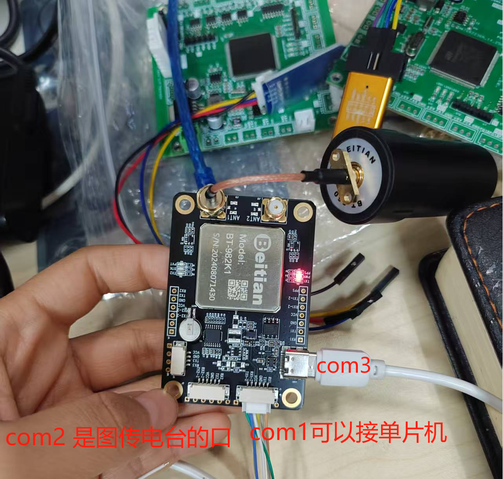

# 模块接口

> COM3可以用来供电也可以接电脑

> COM1就是需要接在单片机上的，串口通信

> COM2是使用基站、移动站时候用的，在两个GPS设备间通信用
# 配置串口一


## 添加usart.c
```c
/* USER CODE BEGIN 0 */
#include "stdio.h"
struct __FILE 
{ 
	int handle; 
}; 

FILE __stdout;       
//定义_sys_exit()以避免使用半主机模式    
void _sys_exit(int x) 
{ 
	x = x; 
} 
//重定义fputc函数 
int fputc(int ch, FILE *f)
{ 	
	 HAL_UART_Transmit(&huart1, (uint8_t *)&ch, 1, 0x0001);  
	return ch;
}
/* USER CODE END 0 */
```
## 编写gps982接收部分
### 串口接收函数`gUart1RcecBuf`
1. 在源文件里初始化
```c
uint8_t gUart1RcecBuf[UART1RX_MAX_LENGTH];
uint16_t gReceCunt=0;
```
2. 在头文件里声明为外部可调用
```c
#define UART1RX_MAX_LENGTH 256
extern uint8_t gUart1RcecBuf[UART1RX_MAX_LENGTH];
```
3. 在main里开启中断
```c
HAL_UART_Receive_IT(&huart1, (uint8_t *)gUart1RcecBuf, 1);
```
> 1就是接收到一个字节就进入回调函数

> 下面就是回调函数，回调函数是直到接收到回车符号'\n'才截止的
4. 回调函数
```c
// 接收完成回调函数
void HAL_UART_RxCpltCallback(UART_HandleTypeDef *huart)
{
	if (huart == &huart1)
    {
        if (gUart1RcecBuf[gReceCunt] == '\n') // 判断是否为结束符
        {
			HAL_GPIO_TogglePin(GPIOC,GPIO_PIN_13);
            /*数据处理*/
            gReceCunt = 0;
        }
        else
        {
            // 不是结束符，继续接收
            gReceCunt++;
            if (gReceCunt >= UART1RX_MAX_LENGTH)
            {
                // 缓冲区已满，重置接收索引
                gReceCunt = 0;
            }
        }

		// 再次开启接收中断，准备下一次接收
		HAL_UART_Receive_IT(&huart1, (uint8_t *)(gUart1RcecBuf + gReceCunt), 1);
	}
}
```
## 编写gps982解析数据部分
### 定义GPS数据的结构体并且声明为外部可调用
```c
/*gps982.h*/
typedef struct {
    uint8_t isGetData;
    uint8_t isValidData;
    char Frame_Buffer[256];
    char UTCTime[20];
    char UsefullFlag[2];
    char latitude[20];
    char N_S[2];
    char longitude[20];
    char E_W[2];
} ReceDataFrame;

extern ReceDataFrame receDataFrame;
```
### main中记得初始化
```c
memset(&receDataFrame, 0, sizeof(ReceDataFrame));
```
## 接收到的消息
```
$GNRMC,015135.000,A,4159.65553,N,12136.79345,E,0.52,0.00,191123,,,A*7F
```
1. 解析
```c
// 从 $GNGGA 语句中提取纬度和经度信息
void extract_lat_lon(const char *sentence, double *lat, double *lon) {
    char *token = strtok((char *)sentence, ",");
    int field_count = 0;
    while (token != NULL) {
        if (field_count == 2) {
            *lat = atof(token);
        } else if (field_count == 4) {
            *lon = atof(token);
        }
        token = strtok(NULL, ",");
        field_count++;
    }
}
```
2. 单位转换
```c
// 将度分格式转换为度分秒格式
void convert_to_dms(double coord, int *degrees, int *minutes, double *seconds) {
    *degrees = (int)coord / 100;
    double fractional_part = coord - (*degrees * 100);
    *minutes = (int)fractional_part;
    *seconds = (fractional_part - *minutes) * 60;
}
```
3. 中断中接收
```c
// 确定是否收到"GMGGA"这一帧数据
if (gUart1RcecBuf[0] == '$' && 
        gUart1RcecBuf[1] == 'G' &&
        gUart1RcecBuf[2] == 'N' &&
        gUart1RcecBuf[3] == 'G' &&
        gUart1RcecBuf[4] == 'G' && 
        gUart1RcecBuf[5] == 'A')
{
    // 是 $GPRMC 或者 $GNRMC，复制数据到接收数据帧结构体
    memcpy(receDataFrame.Frame_Buffer, gUart1RcecBuf, gReceCunt + 1);
    receDataFrame.Frame_Buffer[gReceCunt + 1] = '\0'; // 添加字符串结束符
    receDataFrame.isGetData = 1; // 设置接收成功标志
}	
```
4. 主函数中的处理逻辑:接收到--是有效值--解析并LCD显示
```c
// 如果数据接收成功
if (receDataFrame.isGetData)
{// 判断是否有效
    If_valid();
}
if (receDataFrame.isValidData)
{
    extract_lat_lon(receDataFrame.Frame_Buffer, &lat, &lon);
    convert_to_dms(lat, &lat_degrees, &lat_minutes, &lat_seconds);
    convert_to_dms(lon, &lon_degrees, &lon_minutes, &lon_seconds);

    char lat_str[50];
    char lon_str[50];
    sprintf(lat_str, "%d^%d'%f\"", lat_degrees, lat_minutes, lat_seconds);
    sprintf(lon_str, "%d^%d'%f\"", lon_degrees, lon_minutes, lon_seconds);

    LCD_DisplayString(1, 5, "lat:");LCD_DisplayString(1, 35, lat_str);
    LCD_DisplayString(1, 65, "lon:");LCD_DisplayString(1, 95, lon_str);

    receDataFrame.isValidData = 0;
}
```
# 配置基站
```
# com2是图传接口
mode base time 60 1.5 2.5
rtcm1006 com2 10       
rtcm1033 com2 10       
rtcm1074 com2 1
rtcm1124 com2 1
rtcm1084 com2 1
rtcm1094 com2 1
com com2 38400
saveconfig
```
GGA(Global positioning system Fix Data)是一种包含全球定位系统(GPS)位置信息的NMEA标准数据类型，其中包括经度、结度高度、卫星数量等数据。GGA消息包含一个定位状态指示器，指示器的值为0表示没有定位，值为1表示标准定位，值为2表示差分定位。

RMC(Recommended Minimum Navigation Information)是另一种包含GPS位置信息的NMEA标准数据类型，其中包括经度、纬度、速度、航向等数据。RMC消息包含一个定位状态指示器，指示器的值为A表示标准定位。
```c
GPGGA COM1 1
GPRMC COM1 1
SAVECONFIG
```
## 度分格式
```
39度6分20.646秒转换为
度分格式是3906.3441
度格式是39.105735度
```
## 角度格式
## 度分秒格式